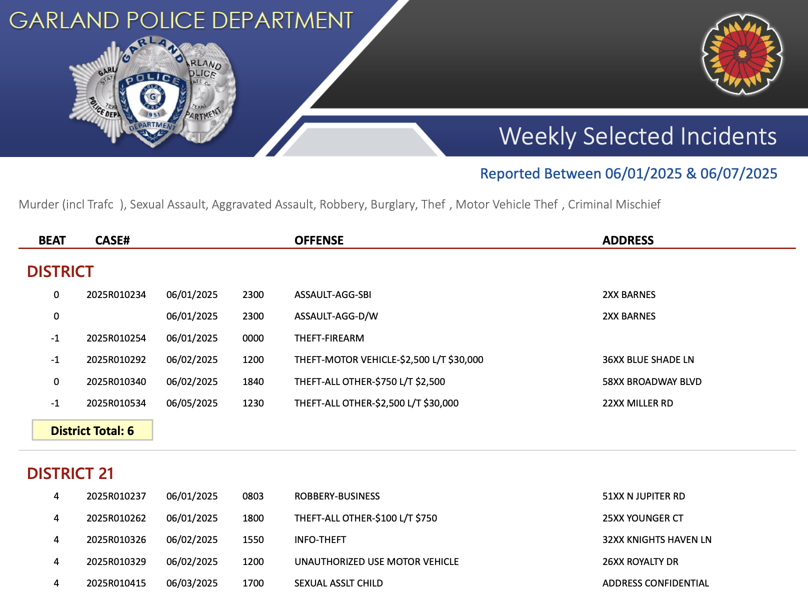
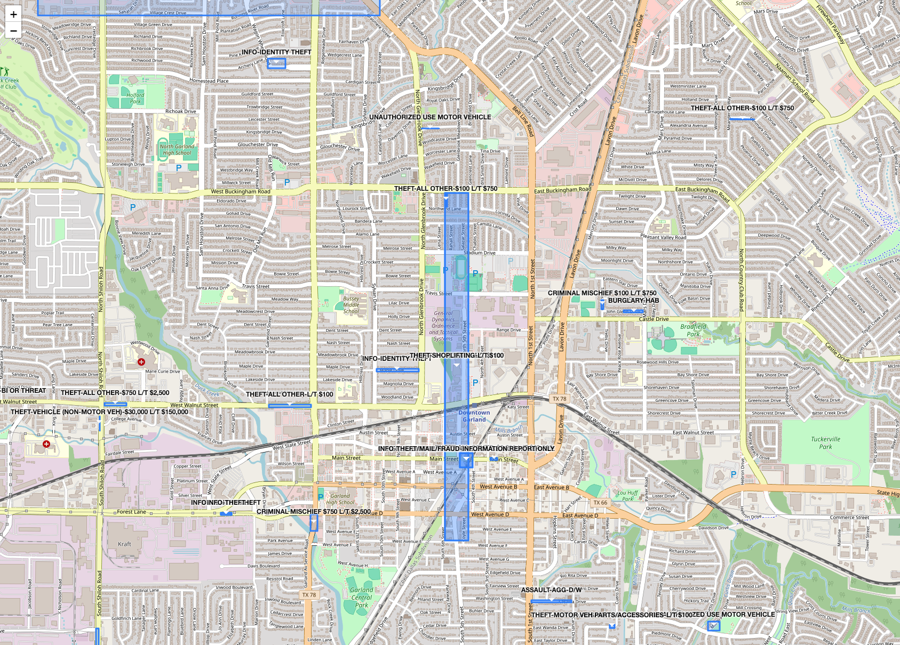
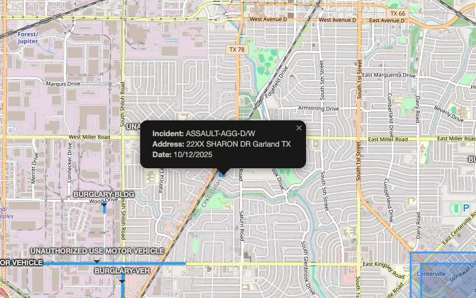

# Garland TX Police Activity Aggregator

This program downloads the previous week incident reports PDF from the Garland TX website and extracts text from the PDF file. It then goes through the text and pulls out the reports from the districts of interest and exports that data to a JSON file.

## Data Source

The data is pulled from the Garland TX Police Department's weekly incident report PDF, which is available on their official website. Below is a screenshot of the PDF as downloaded and processed by this program:



The `.env` file needs to look something like this:

```
DISTRICTS_OF_INTEREST=41,42,43,44
```

Example output:

```json
{
  "41": [
    {
      "date": "06/02/2025",
      "incident": "THEFT-ALL OTHER-$2,500 L/T $30,000",
      "location": "32XX HERRMANN DR"
    },
    {
      "date": "06/03/2025",
      "incident": "BURGLARY-VEH",
      "location": "20XX WESTCHESTER DR"
    }
  ]
}
```

### Long term goals

- Be able to plot incidents on a map
- Add a weekly email feature with the map and list of incidents
- Create a small backend where people can sign up for a weekly email and select the districts they are interested in.

### Mapping the data

Below is a screenshot of the plotted incidents on a map. We roughly estimated the addresses by drawing a box between the beginning of the address range and the end of it.



Clicking on one of those blue boxes will show the full data we have on the incident:



### Roadmap

- For anything set to "Address confidential" document it in its own section on the outputted map. Obviously we want to still service this incident to the user
- Implement a top 10 incidents of the past 3 months (or something similar) that highlights more aggravated categories even in the past few weeks or months so that users have a better idea of whats going on even if something did not happen in the past week.
- Make the email recipient var a list and loop through it

### Running the project

#### Web/PDF scrapper

```bash
cd scrape-incidents
pipenv run python src/main.py
```
