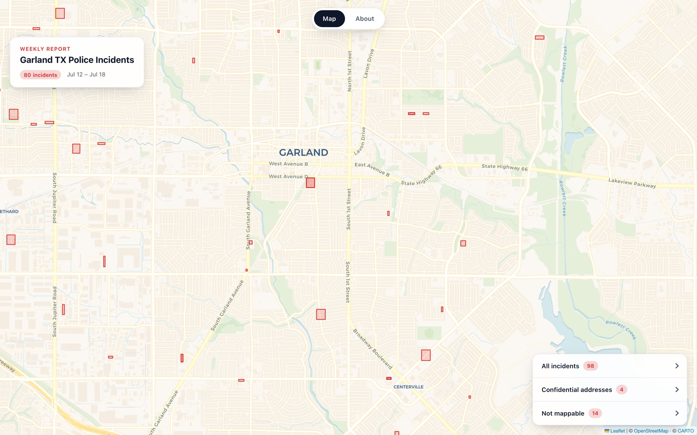
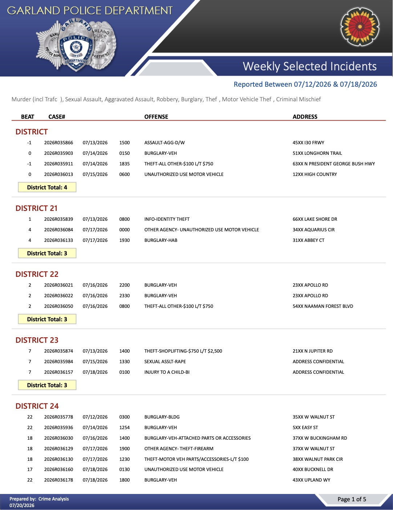
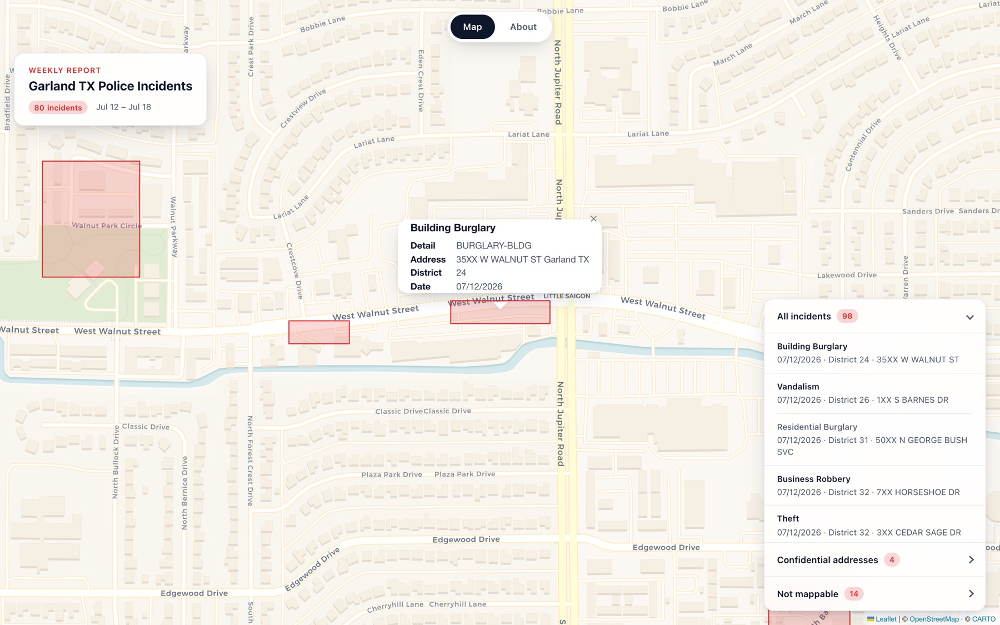
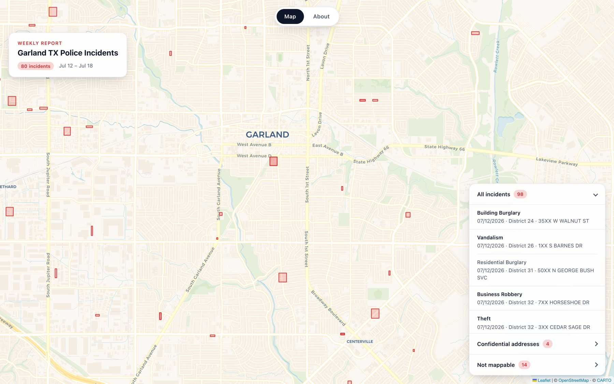
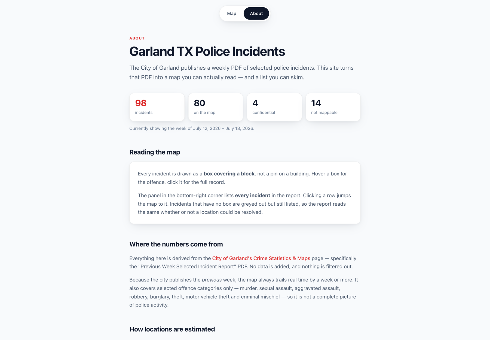
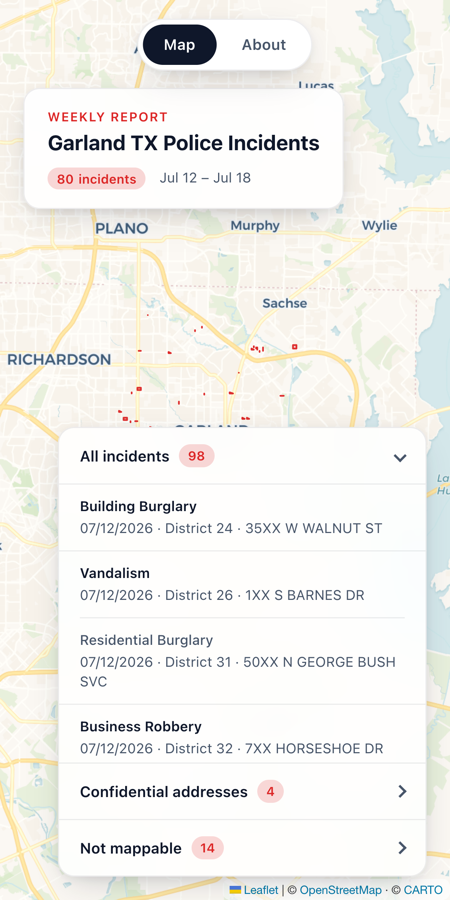
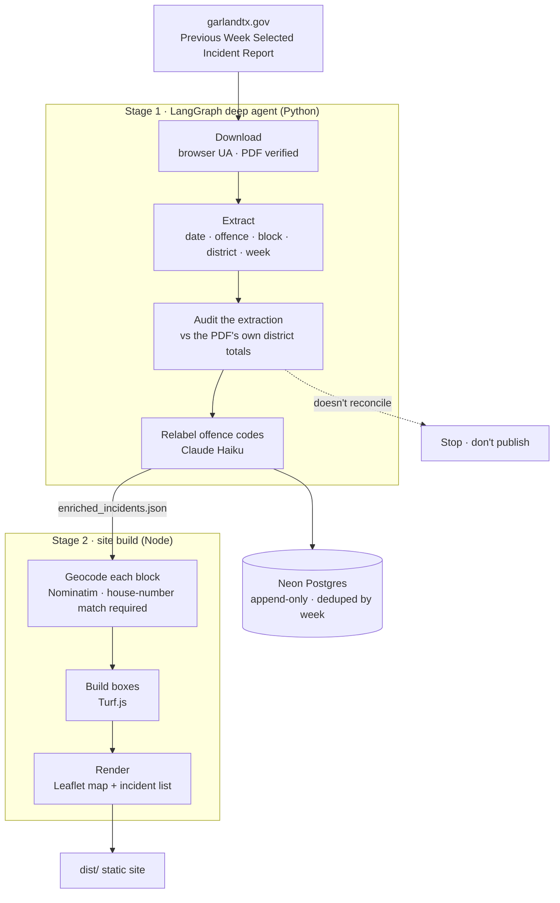

<div align="center">

# Garland TX Police Activity

**The Garland Police Department publishes a weekly PDF of selected incidents.
This turns it into a map you can read — and a list you can skim.**

[**View the live map →**](https://garland-tx-police-activity.vercel.app)



</div>

---

## From this, to that

The city ships a five-page PDF. Every address in it is a *block* —
`35XX W WALNUT ST`, never a house number — which is the single fact that shapes
the whole project.

<table>
<tr>
<td width="50%" valign="top">



**The input.** Offence codes like
`THEFT-MOTOR VEH PARTS/ACCESSORIES-$750 L/T $2,500`, addresses masked to the
block, and a `DISTRICT` header that sometimes arrives without its number.

</td>
<td width="50%" valign="top">



**The output.** A box covering the block, a plain-English label, and the full
record on click.

</td>
</tr>
</table>

## Why boxes, not pins

A pin would claim to know the house. The data doesn't. So each incident is drawn
as a box spanning its block — the honest shape for "somewhere along here".

Getting that right is most of the work. Asking a geocoder for `3799 W BUCKINGHAM RD`
returns the *entire road* and an arbitrary point on it, which in one measured
case sat **3.7 km** from the actual block. So a result is only trusted when it
matches a real street address:

| | before | after |
|---|---|---|
| median box | 117 m | 116 m |
| p90 | 222 m | 199 m |
| **largest box** | **1789 m** | **218 m** |
| **boxes over 300 m** | **7** | **0** |

Anything that can't be pinned to a real address is left off the map rather than
drawn somewhere plausible-looking but false — and then listed anyway, so the
report reads the same either way.

## Screens

<table>
<tr>
<td width="50%" valign="top">

<em><strong>Every incident, browsable.</strong> Click a row to jump the map to it.
Rows with no box are greyed out but still listed.</em>
</td>
<td width="50%" valign="top">

<em><strong>About page.</strong> Stat cards and the report period are read from the
build output, so they can't drift from what's published.</em>
</td>
</tr>
</table>

<div align="center">

<br><em>Works on a phone too.</em>
</div>

## How it works


```mermaid
flowchart TD
    PDF["garlandtx.gov<br/>Previous Week Selected Incident Report"]

    subgraph crew["Stage 1 · LangGraph deep agent (Python)"]
        DL["Download<br/>browser UA · PDF verified"]
        EX["Extract<br/>date · offence · block · district · week"]
        AU["Audit the extraction<br/>vs the PDF's own district totals"]
        LB["Relabel offence codes<br/>Claude Haiku"]
    end

    subgraph build["Stage 2 · site build (Node)"]
        GC["Geocode each block<br/>Nominatim · house-number match required"]
        BX["Build boxes<br/>Turf.js"]
        RN["Render<br/>Leaflet map + incident list"]
    end

    DB[("Neon Postgres<br/>append-only · deduped by week")]
    OUT["dist/ static site"]

    PDF --> DL --> EX --> AU --> LB
    AU -.->|"doesn't reconcile"| STOP["Stop · don't publish"]
    LB --> DB
    LB -->|"enriched_incidents.json"| GC --> BX --> RN --> OUT
```

Stage 1 is a [deep agent](https://github.com/langchain-ai/deepagents): the tools
do the deterministic work — fetch, parse, store — and the agent decides how to
sequence them and whether the result is fit to publish. It delegates to two
subagents: one audits the extraction, one writes the plain-English offence
labels.

The audit is the point. Every district block in the PDF ends with its own
`District Total: N`, so the parse can be checked against the source instead of
trusted. When a numbered district doesn't reconcile, the auditor reads the raw
page to find out what the parser missed, and the run stops rather than
publishing a short week.

Three properties worth knowing, because the first two were bugs once:

- **A failed download stops the run.** It used to return an error string, so the
  pipeline would carry on and silently re-publish whatever stale PDF was on disk.
- **Re-running is idempotent.** The database compares per-key counts, so a
  second run adds nothing — while still keeping the genuine "same block, same
  day, same offence" repeats that a single week really does contain. That is
  also why the `incidents` table has no unique constraint over the natural key:
  one would silently swallow those repeats.
- **The week is knowingly incomplete.** The report's first block arrives under a
  bare `DISTRICT` header with no number, and rows that can't be attributed to a
  district are dropped. In the 07/12/2026 report that is 4 of 102. Every
  numbered district reconciles exactly; the shortfall is now counted and
  reported on each run rather than being invisible.

## Quick start

**Prerequisites** — Python 3.11–3.14, Node 18+, [uv](https://docs.astral.sh/uv/),
and an Anthropic API key.

```bash
git clone https://github.com/caleblawrence/garland-tx-police-activity
cd garland-tx-police-activity
```

Give the agent a key and a database. The history lives in
[Neon](https://neon.tech) Postgres; the free tier is plenty for a few hundred
rows a week.

```bash
cat > agent-solution/garland_tx_data_analysis/.env <<'EOF'
ANTHROPIC_API_KEY=sk-ant-...
DATABASE_URL=postgresql://...        # Neon: main branch
TEST_DATABASE_URL=postgresql://...   # Neon: a `test` branch — the suite truncates this
EOF
```

The agent creates the `incidents` table on first write. Coming from the old
TinyDB file, `uv run migrate_history` imports it once, preserving ids.

**Stage 1** — fetch, parse, audit and label the latest weekly report:

```bash
cd agent-solution/garland_tx_data_analysis
uv sync
uv run run_agent
```

**Stage 2** — geocode the blocks and build the site:

```bash
cd ../../incident-geo-analysis
npm install
npm run build
npm run serve
```

Then open <http://localhost:8080>.

> [!NOTE]
> The first build geocodes every block against Nominatim at one request per
> second, so expect a few minutes. Results are cached in
> `dist/geocode-cache.json`, and later runs reuse them.

## Tests

```bash
cd incident-geo-analysis && npm test          # 26 tests
```

```bash
cd agent-solution/garland_tx_data_analysis && uv run pytest tests/   # 14 tests
```

The six Postgres-backed tests run against the Neon `test` branch and skip if
`TEST_DATABASE_URL` is unset, so a fresh clone with no database still passes.

## Layout

```
agent-solution/garland_tx_data_analysis/   Stage 1 — the deep agent
  src/.../agent.py                         agent, subagents and system prompts
  src/.../tools.py                         download · parse · read · store
  src/.../main.py                          entrypoint, streams the run
  src/.../backfill.py                      one-time TinyDB -> Postgres import
  incidents.db                             frozen backup of the pre-Postgres history
  enriched_incidents.json                  handoff to stage 2
  run-report.md                            what the last run did (written by the agent)

incident-geo-analysis/                     Stage 2 — the site
  src/geo.js                               geocoding and box geometry
  src/index.js                             build script
  src/map.html, src/about.html             the two pages
  dist/                                    build output (deployed)
```

## Reading the data honestly

- **It trails real time.** The city publishes the *previous* week.
- **It isn't all crime.** Only selected categories — murder, sexual assault,
  aggravated assault, robbery, burglary, theft, motor vehicle theft and criminal
  mischief.
- **Boxes are approximate,** and a few will be wrong. Treat them as "this block,
  give or take".
- **Some incidents have no box.** Confidential addresses are withheld by the
  city; freeway blocks and streets missing from OpenStreetMap can't be resolved.
  Both are listed in the side panel.

## Roadmap

- [x] Keep every week in one database, tagged and deduped
- [x] Check each extraction against the report's own district totals
- [ ] Surface that history in the UI — trends and week-over-week views
- [ ] Filter by district and offence category
- [ ] Highlight violent and aggravated offences
- [ ] Publish a new week automatically instead of by hand
- [ ] Recover the incidents dropped by the PDF's unnumbered `DISTRICT` header
      (now counted and reported each run, but still dropped)

---

<div align="center">
<sub>Not affiliated with the City of Garland or the Garland Police Department.<br>
Incident data © City of Garland · map data © OpenStreetMap contributors</sub>
</div>
