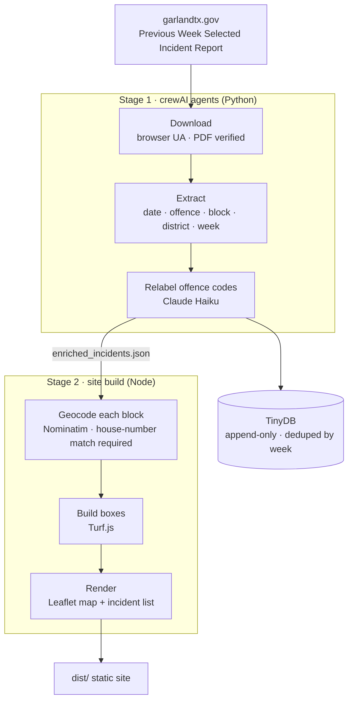

<div align="center">

# Garland TX Police Activity

**The Garland Police Department publishes a weekly PDF of selected incidents.
This turns it into a map you can read — and a list you can skim.**

[**View the live map →**](https://garland-tx-police-activity.vercel.app)


</div>

---

## From this, to that

The city ships a five-page PDF. Every address in it is a *block* —
`35XX W WALNUT ST`, never a house number — which is the single fact that shapes
the whole project.

<table>
<tr>
<td width="50%" valign="top">


**The input.** Offence codes like
`THEFT-MOTOR VEH PARTS/ACCESSORIES-$750 L/T $2,500`, addresses masked to the
block, and a `DISTRICT` header that sometimes arrives without its number.

</td>
<td width="50%" valign="top">


**The output.** A box covering the block, a plain-English label, and the full
record on click.

</td>
</tr>
</table>

## Why boxes, not pins

A pin would claim to know the house. The data doesn't. So each incident is drawn
as a box spanning its block — the honest shape for "somewhere along here".

Getting that right is most of the work. Asking a geocoder for `3799 W BUCKINGHAM RD`
returns the *entire road* and an arbitrary point on it, which in one measured
case sat **3.7 km** from the actual block. So a result is only trusted when it
matches a real street address:

| | before | after |
|---|---|---|
| median box | 117 m | 116 m |
| p90 | 222 m | 199 m |
| **largest box** | **1789 m** | **218 m** |
| **boxes over 300 m** | **7** | **0** |

Anything that can't be pinned to a real address is left off the map rather than
drawn somewhere plausible-looking but false — and then listed anyway, so the
report reads the same either way.

## Screens

<table>
<tr>
<td width="50%" valign="top">

<em><strong>Every incident, browsable.</strong> Click a row to jump the map to it.
Rows with no box are greyed out but still listed.</em>
</td>
<td width="50%" valign="top">

<em><strong>About page.</strong> Stat cards and the report period are read from the
build output, so they can't drift from what's published.</em>
</td>
</tr>
</table>

<div align="center">

<br><em>Works on a phone too.</em>
</div>

## How it works


```mermaid
flowchart TD
    PDF["garlandtx.gov<br/>Previous Week Selected Incident Report"]

    subgraph crew["Stage 1 · crewAI agents (Python)"]
        DL["Download<br/>browser UA · PDF verified"]
        EX["Extract<br/>date · offence · block · district · week"]
        LB["Relabel offence codes<br/>Claude Haiku"]
    end

    subgraph build["Stage 2 · site build (Node)"]
        GC["Geocode each block<br/>Nominatim · house-number match required"]
        BX["Build boxes<br/>Turf.js"]
        RN["Render<br/>Leaflet map + incident list"]
    end

    DB[("TinyDB<br/>append-only · deduped by week")]
    OUT["dist/ static site"]

    PDF --> DL --> EX --> LB
    LB --> DB
    LB -->|"enriched_incidents.json"| GC --> BX --> RN --> OUT
```

Two properties worth knowing, because both were bugs once:

- **A failed download stops the run.** It used to return an error string, so the
  crew would carry on and silently re-publish whatever stale PDF was on disk.
- **Re-running is idempotent.** The database compares per-key counts, so a
  second run adds nothing — while still keeping the genuine "same block, same
  day, same offence" repeats that a single week really does contain.

## Quick start

**Prerequisites** — Python 3.10–3.12, Node 18+, [uv](https://docs.astral.sh/uv/),
and an Anthropic API key.

```bash
git clone https://github.com/caleblawrence/garland-tx-police-activity
cd garland-tx-police-activity
```

Point the crew at a model:

```bash
cat > agent-solution/garland_tx_data_analysis/.env <<'EOF'
MODEL=claude-haiku-4-5-20251001
ANTHROPIC_API_KEY=sk-ant-...
EOF
```

**Stage 1** — fetch, parse and label the latest weekly report:

```bash
cd agent-solution/garland_tx_data_analysis
crewai install
crewai run
```

**Stage 2** — geocode the blocks and build the site:

```bash
cd ../../incident-geo-analysis
npm install
npm run build
npm run serve
```

Then open <http://localhost:8080>.

> [!NOTE]
> The first build geocodes every block against Nominatim at one request per
> second, so expect a few minutes. Results are cached in
> `dist/geocode-cache.json`, and later runs reuse them.

## Tests

```bash
cd incident-geo-analysis && npm test          # 26 tests
```

```bash
cd agent-solution/garland_tx_data_analysis && PYTHONPATH=src .venv/bin/python -m pytest tests/
```

## Layout

```
agent-solution/garland_tx_data_analysis/   Stage 1 — crewAI crew
  src/.../crew.py                          agents and task definitions
  src/.../tools/custom_tool.py             download · extract · store
  incidents.db                             append-only history, tagged by week
  enriched_incidents.json                  handoff to stage 2

incident-geo-analysis/                     Stage 2 — the site
  src/geo.js                               geocoding and box geometry
  src/index.js                             build script
  src/map.html, src/about.html             the two pages
  dist/                                    build output (deployed)

scrape-incidents/                          legacy: the original Python scraper
persistance/                               legacy: an early storage experiment
```

## Reading the data honestly

- **It trails real time.** The city publishes the *previous* week.
- **It isn't all crime.** Only selected categories — murder, sexual assault,
  aggravated assault, robbery, burglary, theft, motor vehicle theft and criminal
  mischief.
- **Boxes are approximate,** and a few will be wrong. Treat them as "this block,
  give or take".
- **Some incidents have no box.** Confidential addresses are withheld by the
  city; freeway blocks and streets missing from OpenStreetMap can't be resolved.
  Both are listed in the side panel.

## Roadmap

- [x] Keep every week in one database, tagged and deduped
- [ ] Surface that history in the UI — trends and week-over-week views
- [ ] Filter by district and offence category
- [ ] Highlight violent and aggravated offences
- [ ] Publish a new week automatically instead of by hand
- [ ] Recover the incidents dropped by the PDF's unnumbered `DISTRICT` header

---

<div align="center">
<sub>Not affiliated with the City of Garland or the Garland Police Department.<br>
Incident data © City of Garland · map data © OpenStreetMap contributors</sub>
</div>
