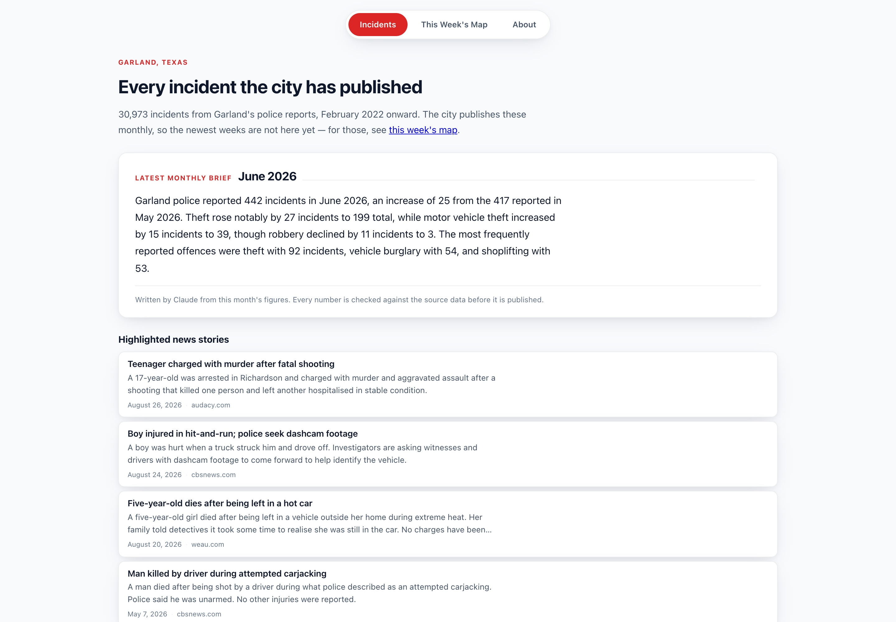
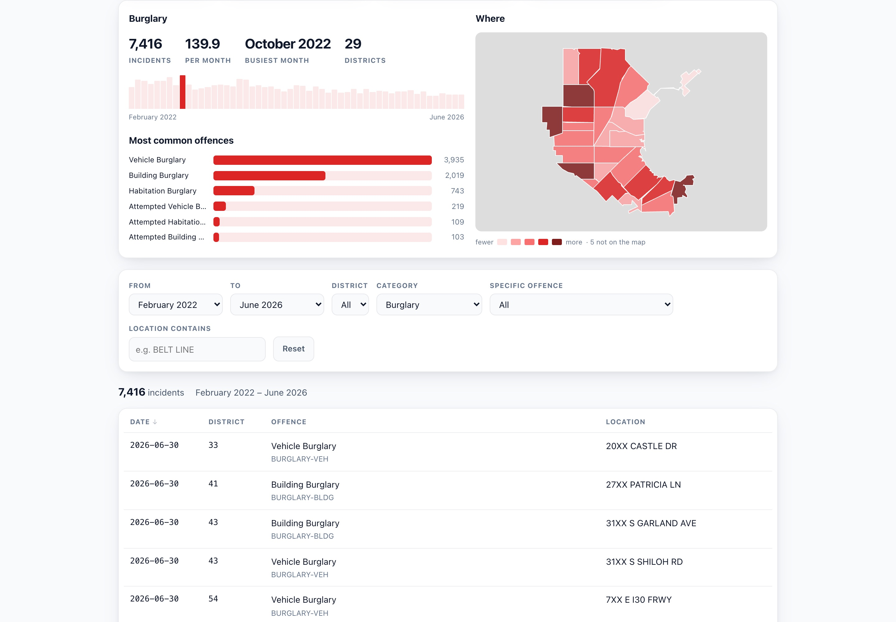
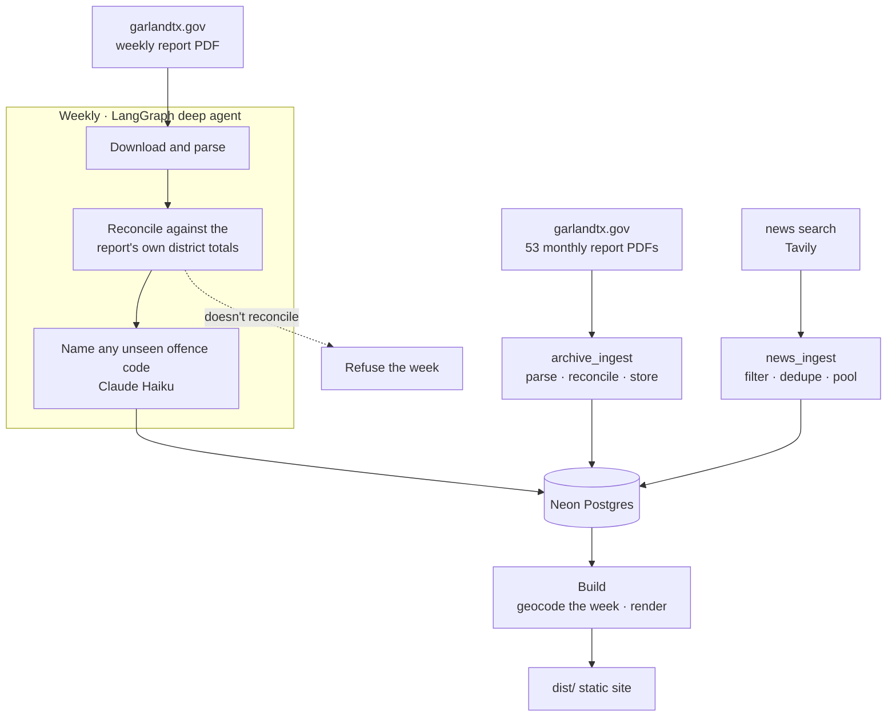

<div align="center">

# Garland TX Police Activity

**Garland publishes its crime reports as PDFs and nothing else. This turns four
and a half years of them into something you can actually read.**

[**Open it →**](https://garland-tx-police-activity.vercel.app)



</div>

---

## What's in it

| | |
|---|---|
| **30,973 incidents** | every monthly report the city has published, February 2022 – June 2026 |
| **53 monthly reports** | parsed, reconciled against their own district totals, and stored |
| **190 offence codes** | each given a plain-English label once, and never renamed |
| **A weekly map** | the current week, drawn as blocks rather than pins |
| **Highlighted news** | coverage of things the reports structurally cannot hold |

The city's own data covers eight offence categories and nothing else. Everything
here is built around that limit rather than pretending it away.

## Browse it



Pick a category and the page answers with a count, a monthly shape going back to
2022, the offences that make it up, and where in the city they happened —
drawn on the police department's own district boundaries, pulled from the city's
ArcGIS server rather than inferred from where incidents happen to geocode.

Underneath is every matching row: date, district, offence and block, filterable
by month range, district, offence and street, and sortable on any column.

**Categories exist because the raw codes are unusable as a filter.** There are
190 of them, including `THEFT-ALL OTHER-TWO OR MORE PREVIOUS CONVICTIONS L/T
$2500`. The nine groupings are the report's own, printed on every page it
publishes, so they can be checked against the source rather than trusted.

## Highlighted news

The reports cover eight categories. Live explosive devices found near a park
produced no charge in any of them, so no record exists and none ever will — and
that is the most significant thing that happened in Garland that month.

A small hand-curated block sits above the archive for exactly those. Coverage is
gathered into a pool of candidates; an item reaches the page only when a person
features it and writes its title and summary. **Nobody is ever named** — people
appear as roles, "a man was charged", never who. Two reasons, both in
[ADR 0002](docs/adr/0002-news-items-never-name-anyone.md): arrest is not
conviction and the correction never travels as far as the original, and the city
withholds addresses for some offences that a news story would put back.

That rule is enforced by the database, not by convention. A featured row without
a hand-written title and summary is rejected outright, so an export can never
fall back to the published headline and print the name it carried.

## This week's map

<table>
<tr>
<td width="50%" valign="top">

</td>
<td width="50%" valign="top">

</td>
</tr>
</table>

Every address in the source is a *block* — `35XX W WALNUT ST`, never a house
number. So each incident is drawn as a box spanning its block, because a pin
would claim to know the house and the data doesn't.

Getting that right is most of the work. Asking a geocoder for
`3799 W BUCKINGHAM RD` returns the *entire road* and an arbitrary point on it,
which in one measured case sat **3.7 km** from the actual block. A result is only
trusted when it matches a real street address:

| | before | after |
|---|---|---|
| median box | 117 m | 116 m |
| p90 | 222 m | 199 m |
| **largest box** | **1789 m** | **218 m** |
| **boxes over 300 m** | **7** | **0** |

Anything that can't be pinned to a real address is left off the map rather than
drawn somewhere plausible but false — and listed anyway, so the week reads the
same either way.

## How it works


```mermaid
flowchart TD
    WK["garlandtx.gov<br/>weekly report PDF"]
    MO["garlandtx.gov<br/>53 monthly report PDFs"]
    NW["news search<br/>Tavily"]

    subgraph agent["Weekly · LangGraph deep agent"]
        DL["Download and parse"]
        RC["Reconcile against the<br/>report's own district totals"]
        LB["Name any unseen offence code<br/>Claude Haiku"]
    end

    DB[("Neon Postgres")]
    SITE["dist/ static site"]

    WK --> DL --> RC --> LB --> DB
    RC -.->|"doesn't reconcile"| STOP["Refuse the week"]
    MO --> ARCH["archive_ingest<br/>parse · reconcile · store"] --> DB
    NW --> NEWS["news_ingest<br/>filter · dedupe · pool"] --> DB
    DB --> BUILD["Build<br/>geocode the week · render"] --> SITE
```

Three sources, three sets of tables, deliberately never joined. The weekly and
monthly reports overlap in time at different grains with no shared identifier,
so a duplicate would be indistinguishable from two real incidents sharing a
block, a day and an offence — see
[ADR 0001](docs/adr/0001-news-items-are-separate-from-incident-records.md).

The weekly pipeline is a [deep agent](https://github.com/langchain-ai/deepagents),
and the interesting part is how little of it is the model's to decide. The tools
settle anything with a right answer; the model calls them in order and writes a
readable account of the run. [Its wiring is documented here](incident-ingest/README.md#how-the-run-is-wired).

**Reconciliation is the load-bearing idea.** Every district block in a report
ends with its own `District Total: N`, so a parse can be checked against the
source instead of trusted. When a numbered district comes up short, that
district's raw lines come back with the shortfall and the store refuses the week
rather than publishing it short. It has caught real bugs: a row whose offence
name wrapped onto a second line, and the report's own date header being read as
an incident.

**Vocabulary lives in [CONTEXT.md](CONTEXT.md)** — what *reconciliation*,
*shortfall*, *coverage* and *featured* mean here, since several of them have a
precise meaning a newcomer would not guess.

## Quick start

**Prerequisites** — Python 3.11–3.14, **Node 18+**, [uv](https://docs.astral.sh/uv/),
an Anthropic API key, and a [Neon](https://neon.tech) Postgres database.

```bash
git clone https://github.com/caleblawrence/garland-tx-police-activity
cd garland-tx-police-activity

cat > incident-ingest/.env <<'EOF'
ANTHROPIC_API_KEY=sk-ant-...
DATABASE_URL=postgresql://...        # Neon: main branch
TEST_DATABASE_URL=postgresql://...   # Neon: a `test` branch — the suite truncates this
TAVILY_API_KEY=tvly-...              # optional, only for gathering news
EOF
```

Tables are created on first write; there is no migration step.

```bash
cd incident-ingest && uv sync

uv run run_agent                                              # this week
uv run python -m garland_tx_data_analysis.archive_ingest --all --apply   # the archive
uv run python -m garland_tx_data_analysis.news_ingest --backfill --apply # news
```

```bash
cd ../incident-geo-analysis
npm install && npm run build && npm run serve
```

Or `./scripts/run-weekly.sh` for the whole thing.

> [!NOTE]
> The first build geocodes every block against Nominatim at one request per
> second, so expect a few minutes. Results are cached in `dist/geocode-cache.json`.

## Tests

```bash
cd incident-ingest && uv run pytest tests/    # 73 tests
```

```bash
cd incident-geo-analysis && npm test          # needs Node 18+
```

The Postgres-backed tests run against the Neon `test` branch and skip when
`TEST_DATABASE_URL` is unset, so a fresh clone with no database still passes.
`DATABASE_URL` is stripped from every test that doesn't ask for a database, so a
test cannot reach production by forgetting to declare that it wants one.

## Layout

```
CONTEXT.md                     the project's vocabulary
docs/adr/                      decisions worth not re-litigating
docs/plans/                    designs settled before they were built

incident-ingest/               Python — everything that reads a PDF or writes a row
  src/.../agent.py             the weekly deep agent and its prompts
  src/.../tools.py             download · parse · reconcile · store
  src/.../archive_ingest.py    the 53 monthly reports
  src/.../news_ingest.py       news search, filtering and dedupe
  src/.../categories.py        offence codes to the report's own categories
  src/.../summary_metric.py    scores a monthly summary against its own rules
  src/.../optimize_summary_prompt.py   evolves that prompt with GEPA
  tests/                       73 tests

incident-geo-analysis/         Node — everything that renders
  src/archive.js               the incident browser and news block
  src/index.js                 the weekly map
  dist/                        build output (deployed)
```

## Reading the data honestly

- **It isn't all crime.** Only eight selected categories. Things outside them —
  a fire, a fatal collision, explosives in a park — are absent from the source,
  not merely unrecorded.
- **The archive trails by months.** The city publishes monthly reports on its own
  schedule; the newest weeks are only on the map.
- **Twelve months are short by 23 rows in total.** Those reports declare more
  incidents in their district totals than their own PDF text contains. Each
  affected month says so on its brief.
- **Boxes are approximate,** and a few will be wrong. Treat them as "this block,
  give or take".
- **Some incidents have no box.** Confidential addresses are withheld by the
  city; freeway blocks and streets missing from OpenStreetMap can't be resolved.
  Both are listed anyway.

## Roadmap

- [x] Keep every report in one database, tagged and deduped
- [x] Check each extraction against the report's own district totals
- [x] Backfill the full monthly archive, 2022 onward
- [x] Filter by district, category and offence
- [x] Surface the history — monthly briefs, trends and district maps
- [x] Highlight news coverage the reports cannot contain
- [ ] [Link news items to the incidents they describe](https://github.com/caleblawrence/garland-tx-police-activity/issues/29)
- [ ] [Surface shifting patterns without inventing them](https://github.com/caleblawrence/garland-tx-police-activity/issues/9)
- [ ] Publish a new week automatically instead of by hand
- [ ] Recover the incidents dropped by the PDF's unnumbered `DISTRICT` header

---

<div align="center">
<sub>Not affiliated with the City of Garland or the Garland Police Department.<br>
Incident data © City of Garland · map data © OpenStreetMap contributors</sub>
</div>
